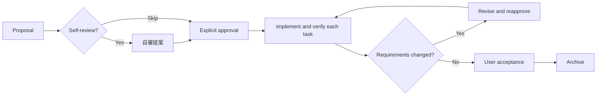

# sdd-workflow

> Version v1.4.0 ｜ [繁體中文](./README.md)

[](./LICENSE)
[](https://www.python.org/)
[](#install)

An **SDD (Spec-Driven Development) Skill** for coding agents such as Claude Code and Codex.

Its goal is to help AI Agents complete most change tasks by turning the expected outcome into a **reviewable, testable specification** before implementation. Features, fixes, refactors, maintenance, and documentation use the same framework, reducing wrong scope, missed acceptance, and stale requirements.

> [!NOTE]
> SDD is not limited to large projects. Small edits use concise proposals; complex work describes more tasks and acceptance conditions. Both retain "agree first, then implement and verify," with state that can recover across sessions. This repository contains a complete Skill package, not a protocol, SDK, or developer kit.

---

## Skill Goals

- **Observable Acceptance Results**: Define the goal, scope, and observable acceptance results so the Agent knows what completion means.
- **Approved Execution**: Split work into independently verifiable tasks and implement only an explicitly approved proposal.
- **Task-by-Task Progress**: Implement and verify one task at a time instead of producing a large batch that is difficult to review.
- **Engineering Evidence**: Load the minimum context before each task, check official documentation for version-dependent decisions, and apply only project-declared quality standards that are relevant to the change.
- **Requirement Freezing**: Stop code changes when requirements change, revise the proposal, and wait for reapproval.
- **Authoritative Recovery**: Recover authoritative state across sessions, handoffs, failed writes, and archival.
- **Fail Closed Safety**: Fail closed when state or evidence is inconsistent instead of guessing or silently repairing it.

---

## Install

The bundled state-management CLI requires CPython 3.11 or newer. macOS and Linux are supported; Windows is best effort. Everyday use remains Agent-driven, so you do not operate the Python CLI yourself. Install the complete `skills/sdd-workflow/` directory, not only `SKILL.md`.

### Codex

```text
$skill-installer install skills/sdd-workflow from the GitHub repo kurotanshi/sdd-workflow into ~/.agents/skills
```

The install location is `~/.agents/skills/sdd-workflow/`. Restart Codex if the Skill does not appear on the next turn.

### Claude Code

```text
Install skills/sdd-workflow from https://github.com/kurotanshi/sdd-workflow into ~/.claude/skills/sdd-workflow
```

The install location is `~/.claude/skills/sdd-workflow/`. Start a fresh session if the Skill does not appear. Other installation, update, and removal methods are covered in [`docs/install-methods.md`](./docs/install-methods.md).

## Your first workflow

1. **Initiate a Proposal (`提案`)**  
   Use `提案` to describe the result you want. Small changes fit too:
   - **Codex**:
     ```text
     $sdd-workflow 提案 Fix the health-check API returning 500 when the database is offline
     ```
   - **Claude Code**:
     ```text
     /sdd-workflow 提案 Fix the health-check API returning 500 when the database is offline
     ```
   The Agent creates `sdd/<short-name>/proposal.md` and `tasks.md`, records the expected outcome and acceptance conditions, validates them, and stops without changing product code. Before drafting cross-module or high-risk work, the Agent read-only inspects the decision-relevant guidance, current change, core flow, callers, configuration, and tests. It checks whether the requested technical direction meets the goal and whether a simpler, more secure, or more maintainable alternative would change the proposal. Small low-risk work still gets a concise draft directly, without a separate review report. A full repository, architecture, or security review that must be tracked and archived through SDD uses a bounded `研究` proposal; a one-off read-only review need not enter SDD, and `自審提案` remains scoped to an existing proposal.

2. **Self-review (optional)**
   Before approval, run `$sdd-workflow 自審提案` in Codex or `/sdd-workflow 自審提案` in Claude Code. The Agent checks the premise, correctness, SDD process, design direction, and applicable risks. It may correct concrete gaps in a draft, but only reports on an approved proposal; self-review never approves or implements.

3. **Review & Start (`開始實作`)**
   Review the proposal, then reply `開始實作`. The Agent approves that version, then implements and verifies one task at a time. Plain `實作` never approves a draft.

4. **Requirement Changes**
   State changed requirements. The Agent revises the proposal and waits for a new `開始實作`.

5. **Accept & Archive (`歸檔 <short-name>`)
   Accept the completed result, then reply `歸檔 <short-name>` to move it under `sdd/archive/`. Replay the example with `python3 examples/sample-web-api/run-walkthrough.py`.

## Workflow and Safety Boundaries

| Phase | Your Action | Agent Boundary |
| :--- | :--- | :--- |
| **Propose** | `提案` | Write and validate the proposal and tasks, then stop without product-code changes |
| **Self-review** | `自審提案` | Review an existing proposal with concrete evidence; never approve or implement, and never rewrite approved content |
| **Approve / Implement** | `開始實作` / `實作` | Implement and validate tasks only for an approved proposal |
| **Revise** | State the requirement change | Stop code changes, update the proposal, and wait for reapproval |
| **Archive** | `歸檔 <short-name>` | Archive only after reliable task completion and user acceptance |
| **Abandon** | `放棄` / `取消提案`, then <br>`確認放棄 <short-name>` | Show a read-only preflight first; never revert code or Git |

- Invoke the workflow explicitly with `$sdd-workflow` or `/sdd-workflow`. The Skill does not expand its trigger surface for generic "analysis" or "cancel" requests.
- A standalone `取消` only asks whether you mean a code/Git rollback or SDD proposal abandonment. Source-control rollback is a separate operation and never changes proposal state as a side effect.
- The bundled CLI is authoritative for proposal state, task progress, snapshots, metadata, archives, and `INDEX.md`. Do not manually edit status, checkboxes, `.sdd` metadata, archive directories, or `INDEX.md`. Follow stable error `code` and `action` values; never use guessing or repeated commands to hide inconsistent state.

---

## Workflow Lifecycle



---

## Task Size and Workflow

The amount of specification should match the task, but this Skill does not skip safety boundaries merely because a change is small:

- **Small Edit**: use a concise proposal, often with one task and a directly observable acceptance result.
- **Typical Feature or Fix**: split distinct outcomes into independently verifiable tasks.
- **Cross-Module or High-Risk Work**: state the impact, regression validation, revision, and recovery considerations.

Cross-file or cross-module work is ordered by dependency and preferably sliced into vertical outcomes that leave the system usable and independently verifiable after each task. There is no fixed file-count limit and no second planning artifact is introduced for this guidance.

During implementation, version-dependent framework, library, SDK, or tool decisions are checked against the project's actual version and official documentation. Before `complete-task`, the Agent applies only a Definition of Done explicitly declared in project instructions, contributor guidance, or CI documentation and relevant to the change. No declaration means no invented check; conflicting declarations stop for clarification.

Every size follows `proposal → explicit approval → task-by-task implementation and verification → user acceptance → archive`. This makes results easier to check, but does not guarantee that an Agent never makes a mistake; acceptance conditions and actual validation remain the evidence of completion.

### Good fits

Most tasks that produce an observable project change fit the SDD framework, including:

- adding a feature, API, CLI, configuration, or automation;
- fixing a reproducible bug and adding regression validation;
- refactoring code or architecture while preserving existing behavior;
- updating dependencies, CI, operations settings, documentation, or public guidance;
- researching a bounded question and recording an evidence-based conclusion; and
- work that benefits from cross-session recovery, Agent handoff, revisions, or traceable approval.

### Usually unnecessary

- Read-only questions, code explanations, or status checks that do not change the project.
- Open-ended exploration without a bounded question and observable conclusion.
- Git/code rollback, emergency recovery, or deployment; these are outside SDD proposal state.
- Generic cancellation that does not target an SDD proposal.

---

## v1.4.0

This minor release adds bounded high-risk proposal intake, approval-relevant baseline and authority-split checks, plus explicitly confirmed, retryable, safely restorable reconstruction for legacy proposals and archives. Existing valid proposals need no conversion; proposal schemas v1/v2 and JSON output version remain unchanged.

Replace the complete package when updating. Never mix files from different releases.

---

## Documentation

- Install, update, and remove: [`docs/install-methods.md`](./docs/install-methods.md)
- Team handoff and worktrees: [`docs/team-operations.md`](./docs/team-operations.md)
- Diagnostics and recovery: [`docs/troubleshooting.md`](./docs/troubleshooting.md)
- Release history: [`CHANGELOG.md`](./CHANGELOG.md)
- Contributing and tests: [`CONTRIBUTING.en.md`](./CONTRIBUTING.en.md)

The canonical Skill lives in one place: [`skills/sdd-workflow/`](./skills/sdd-workflow/) in this repo. Copies installed into tool directories (such as `~/.claude/skills/` or `~/.agents/skills/`) are regenerated artifacts and get overwritten on every update. To change the Skill, edit the repo source and reinstall; never edit an installed copy, or your changes will be lost on the next update and the tools will drift apart.

---

## Acknowledgements

This repository and Skill are inspired by [SimpleSDD](https://gist.github.com/kaochenlong/27ade9a6218244c2584777fa276d1214), shared by @kaochenlong at the 2026 AI conference.

---

## Contributors

<a href="https://github.com/kurotanshi/sdd-workflow/graphs/contributors"></a>

---

## License

MIT (see [LICENSE](./LICENSE))
