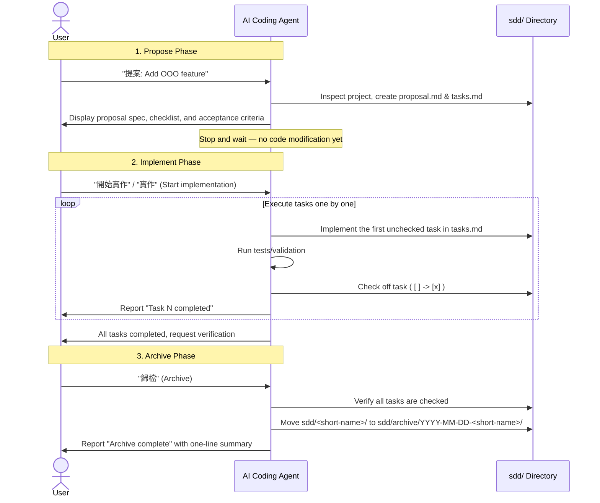

# sdd-workflow

> Version v0.1.0 ｜ [繁體中文](./README.md)

A cross-agent **SDD (Spec-Driven Development)** skill. One idea: **before writing any code, state clearly what will be done, get it approved, then build.**

Every request is split into three phases. Each phase stops and waits for your confirmation instead of running ahead:

| Phase | Trigger | What it does |
| --- | --- | --- |
| 1. Propose | `提案` | Pick a short name, classify the change (feature / bug fix / refactor), produce `sdd/<short-name>/proposal.md` and `tasks.md`, then **stop and wait — no code yet** |
| 2. Implement | `實作` / `開始實作` | Work the `tasks.md` checklist one item at a time, reporting after each; stop and ask if the spec turns out wrong |
| 3. Archive | `歸檔` | Once every item is checked, move `sdd/<short-name>/` to `sdd/archive/<date>-<short-name>/` |

All artifacts are plain text under your project's `sdd/` directory, version-controlled with git.

The **single maintained source** of the workflow is [`skills/sdd-workflow/SKILL.md`](./skills/sdd-workflow/SKILL.md). Copies installed into each tool are reproducible install artifacts, not a second source of truth.

> The trigger words (`提案` / `實作` / `歸檔`) are intentionally Traditional Chinese, and so is the workflow's user-facing output. The skill instructions themselves are written in English for cross-tool maintainability.

## Workflow



### Directory Structure

```text
Project Root/
└── sdd/
    ├── <short-name>/         # Active change proposal (e.g., sdd/add-health-check/)
    │   ├── proposal.md       # Change proposal details (Type, Why, Scope)
    │   └── tasks.md          # Checklist & acceptance criteria (max 10 tasks, unchecked)
    └── archive/              # Archived history
        └── YYYY-MM-DD-<short-name>/
            ├── proposal.md
            └── tasks.md      # All tasks checked ([x])
```

### Preview of Generated Artifacts

`sdd/<short-name>/proposal.md` Example:

```markdown
# add-health-check

## 類型 (Type)
新功能 (New Feature)

## 為什麼做 (Why)
為了讓監控系統能確認服務是否正常運作。
(Allow monitoring systems to verify service availability.)

## 要改什麼 (Scope of Changes)
- 新增 `/api/health` 路由，回傳 JSON `{"status": "ok"}`。

## 影響範圍 (Impact Area)
- 新增 (New): `src/routes/health.js`
- 修改 (Modified): `src/app.js`
```

`sdd/<short-name>/tasks.md` Example:

```markdown
- [ ] 1. Create health check route file handling GET /api/health
- [ ] 2. Register route in main app.js
- [ ] 3. Add unit test to verify status ok response

## 驗收條件 (Acceptance Criteria)
- 情境：當發送 GET 請求至 /api/health，應收到 200 狀態碼與 JSON `{"status": "ok"}`
  (Scenario: send a GET request to /api/health, expect a 200 status code and JSON `{"status": "ok"}`)
```

> In the real artifacts, headings and content are Traditional Chinese (per the skill's template, regardless of tool); the English in these two examples is added for readability only.

## Install and get started

> [!IMPORTANT]
> **Post-installation note**: After installing or updating the skill, you usually need to **start a fresh conversation session** (e.g., restart Claude Code) for it to be loaded; in an already-open session the agent may not recognize the newly installed skill. Exception: when installed via Codex's built-in skill-installer, the skill becomes available on the **next turn** of the same conversation.

Pick the path for your tool. Each channel's installer manages its own destination; this repo does not ship its own end-user installer.

### Codex

Ask Codex's built-in skill-installer to install from this repo:

```text
$skill-installer install skills/sdd-workflow from the GitHub repo kurotanshi/sdd-workflow
```

This runs `install-skill-from-github.py --repo kurotanshi/sdd-workflow --path skills/sdd-workflow`, installs into `~/.codex/skills/sdd-workflow/`, and becomes available on the **next turn**. (Manual install: copy the whole `skills/sdd-workflow/` folder to `~/.codex/skills/sdd-workflow`.)

Verify in a fresh Codex conversation:

```text
$sdd-workflow 提案 Add a health-check API to my project
```

### Claude Code

Claude Code has no built-in "install a skill from GitHub" command; the fastest way is to ask it to install the skill itself:

```text
Install skills/sdd-workflow from https://github.com/kurotanshi/sdd-workflow into ~/.claude/skills/sdd-workflow
```

If you'd rather not let the agent run commands, install manually:

```bash
rm -rf /tmp/sdd-workflow
git clone https://github.com/kurotanshi/sdd-workflow.git /tmp/sdd-workflow
mkdir -p ~/.claude/skills
cp -R /tmp/sdd-workflow/skills/sdd-workflow ~/.claude/skills/sdd-workflow
```

> Copy the **entire `skills/sdd-workflow/` folder** (including `agents/`, not just `SKILL.md`). If `~/.claude/skills/sdd-workflow` already exists (reinstall), delete the old folder first. Claude Code v2.1.203+ also supports a symlinked skill.

Verify in a fresh Claude Code session:

```text
/sdd-workflow 提案 Add a health-check API to my project
```

### Other channel: cross-agent Skills CLI (third party)

[`npx skills`](https://skills.sh/) is a package manager for the open agent-skills ecosystem, targeting many agents at once:

```bash
npx skills add kurotanshi/sdd-workflow --skill sdd-workflow -g -y
```

`-g` installs at user level, `-y` skips prompts. The source is recorded in that tool's lock file.

> ⚠️ This is a third-party tool (skills.sh), not an official OpenAI or Anthropic installer. It places the skill in the shared `~/.agents/skills/`. **Verify your agent actually loads that directory** — different tools read different skill paths (e.g. Codex's own toolchain uses `~/.codex/skills`). If it isn't picked up, use the native install path for your tool above.

## Usage

Trigger syntax for both tools:

| Tool | Explicit trigger | Natural-language trigger |
| --- | --- | --- |
| [Claude Code](https://claude.com/claude-code) (Anthropic) | `/sdd-workflow 提案 …` | Just say `提案: …` / `開始實作` / `歸檔` |
| [Codex](https://github.com/openai/codex) (OpenAI/GPT) | `$sdd-workflow 提案 …` | Just say `提案: …` / `開始實作` / `歸檔` |

Explicit syntax is preferred (clear and predictable); natural-language triggering is a convenience that relies on the model selecting the skill from its description. If your tool does not automatically pick the skill, use the explicit syntax.

The normal workflow has three steps:

1. **Propose**: the agent creates `sdd/<short-name>/proposal.md` and `sdd/<short-name>/tasks.md` (a task checklist plus acceptance criteria), then stops for your approval. It should not change product code in this step.
2. **Implement**: after reviewing the proposal, explicitly reply with `開始實作` or `實作`. The agent works through `tasks.md` one item at a time, checks off each completed item, and reports progress. If the spec turns out wrong, it should stop and ask. Once every task is done, it reports completion and asks you to verify the acceptance criteria.
3. **Archive**: after you accept the result, reply with `歸檔`. The agent verifies every task is complete, then moves `sdd/<short-name>/` to `sdd/archive/<date>-<short-name>/`.

## Update and remove

| Tool / channel | Update | Remove |
| --- | --- | --- |
| Codex | Delete `${CODEX_HOME:-$HOME/.codex}/skills/sdd-workflow`, then reinstall (the installer aborts on an existing dir) | Delete `${CODEX_HOME:-$HOME/.codex}/skills/sdd-workflow` |
| Claude Code | Delete `~/.claude/skills/sdd-workflow`, then reinstall | Delete `~/.claude/skills/sdd-workflow` |
| Skills CLI (third party) | `npx skills update sdd-workflow -g -y` | `npx skills remove sdd-workflow -g -y` |

## Authors / contributors: local development

> This section is only for people **editing this repo's skill itself**. Regular users should install via "Install and get started" above.

Normal installation is a **copy**: your tool reads the copy under `~/.claude/skills/` or `~/.codex/skills/`. Editing `SKILL.md` in this repo does not change that copy, so you would have to re-copy after every edit to test anything.

`scripts/link-dev.sh` replaces the copy with a symlink, pointing the tool's skills directory straight at this repo's `skills/sdd-workflow/`. From then on, any edit in the repo takes effect in the next fresh session:

```bash
scripts/link-dev.sh                # link into Claude Code and Codex
scripts/link-dev.sh --claude-only  # Claude only
scripts/link-dev.sh --codex-only   # Codex only
scripts/link-dev.sh --unlink       # remove the symlinks when done
scripts/link-dev.sh --help
```

The script is deliberately conservative: if the destination already holds a file / directory / other symlink, it stops and touches nothing (it will never overwrite an installed copy); `--unlink` only removes symlinks that provably resolve to this repo. Target directories can be overridden with the `CLAUDE_SKILLS_DIR` / `CODEX_SKILLS_DIR` environment variables (for hermetic testing or a verified Codex skill root).

> After linking, confirm the skill actually loads in a **fresh session** of both Claude Code and Codex.

## Acknowledgements

This repo / skill is inspired by [SimpleSDD](https://gist.github.com/kaochenlong/27ade9a6218244c2584777fa276d1214), shared by @kaochenlong at the 2026 AI conference.

## License

MIT (see [LICENSE](./LICENSE))
