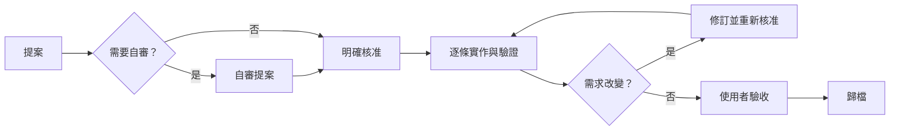

# sdd-workflow

> 版本 v1.2.0 ｜ [English](./README.en.md)

[](./LICENSE)
[](https://www.python.org/)
[](#安裝)

給 Claude Code、Codex 等 coding agent 使用的 **SDD（Spec-Driven Development，規格驅動開發）Skill**。

它的目標是讓 AI Agent 在執行大多數變更任務時，先把預期成果變成**可審查、可驗收的規格**，再依序實作與驗證。新功能、修 bug、重構、維運與文件調整都能使用同一套框架，降低 Agent 改錯範圍、漏掉驗收，或在需求已改變後仍繼續實作的風險。

> [!NOTE]
> SDD 不只適用於大型專案。小修改可以使用精簡的 proposal，複雜工作則寫出更完整的任務與驗收條件；兩者都保留「先確認、再實作、逐項驗證」的核心邊界。範圍、核准、進度與修訂狀態會保存在專案內，讓流程可以跨 session 恢復。這個 repository 的產品是完整的 Skill package，不是 protocol、SDK 或 developer kit。

---

## 設計重點

- **明確的驗收目標**：先定義目標、範圍與可觀察的驗收結果，讓 Agent 清楚掌握「怎樣才算完成」。
- **核准導向實作**：將工作拆解為獨立可驗證的 task，唯有取得明確核准 (`開始實作`) 的 proposal 才能進入實作。
- **逐條實作與驗證**：每次實作並驗證一條 task，避免一次產生大量難以核對的變更。
- **需求變更即時凍結**：需求改變時停止改碼、修訂 proposal，取得重新核准後再繼續。
- **狀態權威與可恢復性**：讓跨 session、交接、失敗重試與歸檔都能從專案中的權威狀態恢復。
- **Fail Closed 安全機制**：狀態不一致或證據不足時 fail closed，不猜測、不靜默修復。

---

## 安裝

bundled state-management CLI 需要 CPython 3.11 以上；macOS 與 Linux 為支援平台，Windows 為 best effort。日常使用仍透過 Agent 對話完成，不需要自行操作 Python CLI。必須安裝完整的 `skills/sdd-workflow/` 目錄，不能只複製 `SKILL.md`。

### Codex

```text
$skill-installer install skills/sdd-workflow from the GitHub repo kurotanshi/sdd-workflow into ~/.agents/skills
```

安裝位置是 `~/.agents/skills/sdd-workflow/`。若下一個 turn 未載入，請重新啟動 Codex。

### Claude Code

```text
Install skills/sdd-workflow from https://github.com/kurotanshi/sdd-workflow into ~/.claude/skills/sdd-workflow
```

安裝位置是 `~/.claude/skills/sdd-workflow/`。若未載入，請開新 session。其他安裝、更新與移除方式見 [`docs/install-methods.md`](./docs/install-methods.md)。

## 第一次 workflow

1. 用 `提案` 說明想完成的結果。小修改也適用：
   - **Codex**：
     ```text
     $sdd-workflow 提案 修正健康檢查 API 在資料庫離線時回傳 500 的問題
     ```
   - **Claude Code**：
     ```text
     /sdd-workflow 提案 修正健康檢查 API 在資料庫離線時回傳 500 的問題
     ```
   Agent 會建立 `sdd/<短名稱>/proposal.md` 與 `tasks.md`，寫出預期成果與驗收條件，驗證後停下，不修改產品程式碼。

2. （可選）在核准前執行 `$sdd-workflow 自審提案`（Codex）或 `/sdd-workflow 自審提案`（Claude Code）。Agent 會檢查前提、正確性、SDD 流程、設計取向與適用的風險條件；草案可修正明確缺口，已核准提案只回報。自審永遠不會核准或實作。

3. 審閱提案後回覆 `開始實作`。Agent 會核准目前版本，逐條實作、驗證並更新 task 進度。只說 `實作` 不會自動核准 draft。

4. 需求改變時直接說明新需求。Agent 會停止改碼、修訂 proposal，等待新的 `開始實作`。

5. 所有 task 完成且你驗收後，回覆 `歸檔 <短名稱>`。提案會移至 `sdd/archive/`。

> [!TIP]
> 可重跑完整案例：`python3 examples/sample-web-api/run-walkthrough.py`

---

## 工作方式與安全邊界

| 階段 | 你的動作 | Agent 的邊界 |
| :--- | :--- | :--- |
| **提案** | `提案` | 寫 proposal 與 tasks，驗證後停下，不改產品碼 |
| **自審** | `自審提案` | 以具體證據檢查既有 proposal；不核准、不實作，已核准內容不改寫 |
| **核准／實作** | `開始實作` / `實作` | 只對已核准 proposal 逐條實作與驗證 |
| **修訂** | 說明需求變更 | 停止改碼，更新 proposal，等待重新核准 |
| **歸檔** | `歸檔 <短名稱>` | 只在可靠 task 全數完成且使用者驗收後歸檔 |
| **放棄** | `放棄` / `取消提案`，再 `確認放棄 <短名稱>` | 先顯示唯讀 preflight；不復原程式碼或 Git |

- 可用 `$sdd-workflow` 或 `/sdd-workflow` 明確啟動流程。Skill 不會因一般的「分析」或「取消」自動擴張觸發範圍。
- 單獨說「取消」只會先詢問你是要復原程式碼／Git，還是放棄 SDD proposal。Source-control rollback 是另一項操作，不會連帶修改 proposal state。
- bundled CLI 是 proposal 狀態、task 進度、snapshot、metadata、archive 與 `INDEX.md` 的權威。不要手動改 status、checkbox、`.sdd` metadata、archive 目錄或 `INDEX.md`。遇到錯誤時依穩定的 `code` 與 `action` 處理；不要用猜測或重跑掩蓋不一致。

---

## SDD 工作流程



---

## 任務大小與流程

SDD 的規格份量應與任務相稱，但這個 Skill 不會因任務很小就略過安全邊界：

- **小型修改**：proposal 可以很短，通常只有一條 task 與直接可觀察的驗收條件。
- **一般功能或修正**：把不同成果拆成數條可獨立驗證的 task。
- **跨模組或高風險工作**：明確記錄影響範圍、回歸驗證、修訂與恢復考量。

不論規模，流程都是 `提案 → 明確核准 → 逐條實作與驗證 → 使用者驗收 → 歸檔`。這套流程提高結果的可核對性，但不保證 Agent 永遠不犯錯；驗收條件與實際測試仍是判斷完成與否的依據。

### 適合使用

只要任務會產生可驗收的專案變更，通常都適合放進 SDD 框架，例如：

- 新增功能、API、CLI、設定或自動化。
- 修正可重現的 bug 並加入回歸驗證。
- 在保持既有行為下重構程式或調整架構。
- 更新依賴、CI、維運設定、文件或公開說明。
- 針對明確問題進行有界研究，並把觀察結果寫成結論。
- 任何需要跨 session、Agent 交接、需求修訂或可追溯核准的工作。

### 通常不需要

- 不會修改專案的唯讀問答、程式碼解釋或狀態查詢。
- 尚未形成具體問題與可驗收結論的開放式探索。
- Git／程式碼 rollback、緊急復原或部署操作；這些不屬於 SDD proposal state。
- 沒有指向 SDD 提案的一般「取消」。

---

## v1.2.0

這個 minor release 新增可選的 `自審提案` 階段：Agent 會以具體位置與實際檢查結果驗證 proposal 的前提、正確性、SDD 流程、設計取向及適用的安全／可逆性／效能／依賴風險。草案可就地修正明確缺口，已核准提案維持唯讀；自審不會核准或實作。proposal schema、CLI 指令與 JSON output version 均不變。

從舊版更新時請替換完整 package，不要混合不同版本的檔案。

---

## 文件

- 安裝、更新與移除：[`docs/install-methods.md`](./docs/install-methods.md)
- 團隊交接與 worktree：[`docs/team-operations.md`](./docs/team-operations.md)
- 診斷與恢復：[`docs/troubleshooting.md`](./docs/troubleshooting.md)
- 版本紀錄：[`CHANGELOG.md`](./CHANGELOG.md)
- 貢獻與測試：[`CONTRIBUTING.md`](./CONTRIBUTING.md)

Skill 的正本只有一份：repo 裡的 [`skills/sdd-workflow/`](./skills/sdd-workflow/)。安裝到各工具目錄（如 `~/.claude/skills/`、`~/.agents/skills/`）的是複製出去的副本，更新時會被整份覆蓋。要修改 Skill，請改 repo 正本後重新安裝；不要直接編輯安裝副本，以免改動在下次更新時遺失，或讓不同工具的行為分歧。

---

## 致謝

本專案受到 @kaochenlong 在 2026 AI 年會分享的 [SimpleSDD](https://gist.github.com/kaochenlong/27ade9a6218244c2584777fa276d1214) 啟發。

---

## Contributors

<a href="https://github.com/kurotanshi/sdd-workflow/graphs/contributors"></a>

---

## License

MIT（見 [LICENSE](./LICENSE)）
