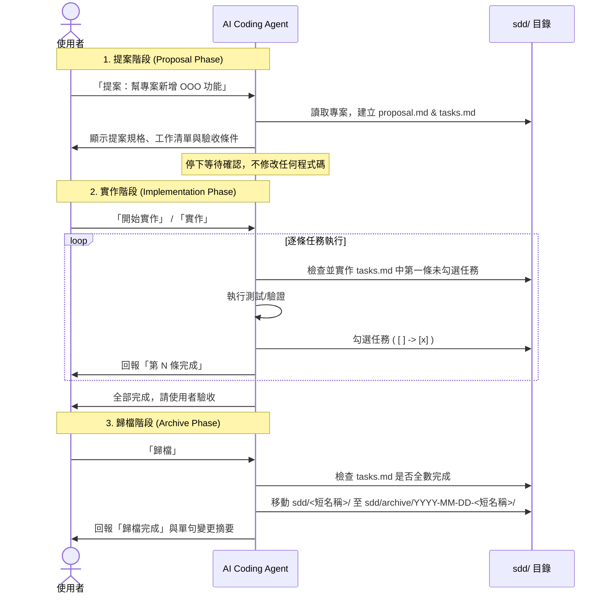

# sdd-workflow

> 版本 v0.1.0 ｜ [English](./README.en.md)

一份跨 AI coding agent 共用的 **SDD（Spec-Driven Development，規格驅動開發）** skill。核心理念一句話：**動手寫程式之前，先把要做什麼寫清楚、讓人確認，再開始做。**

它把每個需求切成三個階段，各階段結束都會停下來等你確認，不會一路暴衝：

| 階段 | 觸發詞 | 做什麼 |
| --- | --- | --- |
| 1. 提案 | `提案` | 取短名稱、判斷類型（新功能／修 bug／重構），產出 `sdd/<短名稱>/proposal.md` 與 `tasks.md`，然後**停下等確認，不寫程式** |
| 2. 實作 | `實作`／`開始實作` | 逐條完成 `tasks.md`，一次一條、做完打勾回報；發現規格不對就停下來問 |
| 3. 歸檔 | `歸檔` | 確認全部打勾後，把 `sdd/<短名稱>/` 移到 `sdd/archive/<日期>-<短名稱>/` |

產出物都是純文字，留在你的專案 `sdd/` 目錄，跟著 git 一起版控。

這個 repo **唯一維護的流程來源**是 [`skills/sdd-workflow/SKILL.md`](./skills/sdd-workflow/SKILL.md)。安裝到各工具的副本只是可重新產生的安裝產物，不是第二份來源。

## 工作流程



### 目錄結構

```text
專案根目錄/
└── sdd/
    ├── <短名稱>/             # 活動中的變更提案 (例如: sdd/add-health-check/)
    │   ├── proposal.md       # 變更提案說明（類型、為什麼做、影響範圍）
    │   └── tasks.md          # 任務清單與驗收條件（最多 10 條，[ ] 狀態）
    └── archive/             # 已歸檔的歷史紀錄
        └── YYYY-MM-DD-<短名稱>/
            ├── proposal.md
            └── tasks.md      # 任務皆為 [x] 狀態
```

### 產出物範本預覽

`sdd/<短名稱>/proposal.md` 範例：

```markdown
# add-health-check

## 類型
新功能

## 為什麼做
為了讓監控系統能確認服務是否正常運作。

## 要改什麼
- 新增 `/api/health` 路由，回傳 JSON `{"status": "ok"}`。

## 影響範圍
- 新增：`src/routes/health.js`
- 修改：`src/app.js`
```

`sdd/<短名稱>/tasks.md` 範例：

```markdown
- [ ] 1. 新增健康檢查路由檔案，處理 GET /api/health
- [ ] 2. 在主程式 app.js 註冊該路由
- [ ] 3. 新增單元測試確保回傳 status ok

## 驗收條件
- 情境：當發送 GET 請求至 /api/health，應收到 200 狀態碼與 JSON `{"status": "ok"}`
```

## 安裝與上手

> [!IMPORTANT]
> **安裝後注意事項**：安裝或更新 Skill 後，通常需要**開新的對話 session**（例如重啟 Claude Code）才會載入；在已開啟的舊對話中輸入指令，Agent 可能無法辨識新安裝的 Skill。例外：用 Codex 內建 skill-installer 安裝時，同一對話的**下一個 turn** 就會生效。

依你使用的工具擇一安裝。各通路的目的地由該安裝工具自己管理，本 repo 不另外提供給一般使用者用的自製 installer。

### Codex

在 Codex 對話中請內建的 skill-installer 從本 repo 安裝：

```text
$skill-installer 從 GitHub 安裝 kurotanshi/sdd-workflow 的 skills/sdd-workflow
```

底層等同 `install-skill-from-github.py --repo kurotanshi/sdd-workflow --path skills/sdd-workflow`，會裝進 `~/.codex/skills/sdd-workflow/`，並在**下一個 turn** 生效。（手動安裝：把整個 `skills/sdd-workflow/` 資料夾複製到 `~/.codex/skills/sdd-workflow`。）

開一個新的 Codex 對話驗證：

```text
$sdd-workflow 提案 幫我的專案加一個健康檢查 API
```

### Claude Code

Claude Code 沒有內建的「從 GitHub 裝 skill」指令，最快的方式是直接請它自己裝：

```text
幫我把 https://github.com/kurotanshi/sdd-workflow 的 skills/sdd-workflow 安裝到 ~/.claude/skills/sdd-workflow
```

不想讓 agent 動手，就手動安裝：

```bash
rm -rf /tmp/sdd-workflow
git clone https://github.com/kurotanshi/sdd-workflow.git /tmp/sdd-workflow
mkdir -p ~/.claude/skills
cp -R /tmp/sdd-workflow/skills/sdd-workflow ~/.claude/skills/sdd-workflow
```

> 要複製**整個 `skills/sdd-workflow/` 資料夾**（含 `agents/`，不是只複製 `SKILL.md`）。若 `~/.claude/skills/sdd-workflow` 已存在（重裝），請先刪掉舊資料夾。Claude Code v2.1.203+ 亦支援 symlinked skill。

開一個新的 Claude Code session 驗證：

```text
/sdd-workflow 提案 幫我的專案加一個健康檢查 API
```

### 其他通路：跨 agent Skills CLI（第三方）

[`npx skills`](https://skills.sh/) 是開放 agent skills 生態的套件管理器，可一次餵給多種 agent：

```bash
npx skills add kurotanshi/sdd-workflow --skill sdd-workflow -g -y
```

`-g` 裝在使用者層、`-y` 略過確認。安裝來源會記錄在該工具的 lock file。

> ⚠️ 這是第三方工具（skills.sh），不是 OpenAI 或 Anthropic 官方 installer。它把 skill 放進共用的 `~/.agents/skills/`。**請自行確認你的 agent 真的會載入該目錄**——不同工具讀取的 skill 路徑不同（例如 Codex 內建工具鏈使用 `~/.codex/skills`）；若沒被載入，請改用上方各工具的原生安裝方式。

## 使用方式

兩個工具的觸發語法：

| 工具 | 明確指令觸發 | 也可自然語言觸發 |
| --- | --- | --- |
| [Claude Code](https://claude.com/claude-code)（Anthropic） | `/sdd-workflow 提案 …` | 直接說「提案：…」／「開始實作」／「歸檔」 |
| [Codex](https://github.com/openai/codex)（OpenAI/GPT） | `$sdd-workflow 提案 …` | 直接說「提案：…」／「開始實作」／「歸檔」 |

明確指令是首選（可預期、不靠模型猜）；自然語言觸發是便利功能，靠模型依 skill 描述自動選用。若工具沒有自動選到 skill，請改用明確指令語法。

> Skill 指令本體為英文（利於跨工具維護），但**觸發詞與對你的輸出維持繁中**。

正常流程會分三步走：

1. **提案**：agent 只會建立 `sdd/<短名稱>/proposal.md` 與 `sdd/<短名稱>/tasks.md`（內含逐條任務清單與「驗收條件」），然後停下來等你確認。這一步不應該修改產品程式碼。
2. **實作**：你看完提案後，明確回覆「開始實作」或「實作」。agent 會一次完成 `tasks.md` 的一條任務，做完打勾並回報；如果發現規格不對，應停下來問。全部做完後會回報「全部完成」，並請你依驗收條件驗收。
3. **歸檔**：你驗收完成後，回覆「歸檔」。agent 會確認 tasks 全部完成，再把 `sdd/<短名稱>/` 移到 `sdd/archive/<日期>-<短名稱>/`。

## 更新與移除

| 工具／通路 | 更新 | 移除 |
| --- | --- | --- |
| Codex | 先刪 `${CODEX_HOME:-$HOME/.codex}/skills/sdd-workflow` 再重裝（installer 遇既有目錄會中止） | 刪除 `${CODEX_HOME:-$HOME/.codex}/skills/sdd-workflow` |
| Claude Code | 先刪 `~/.claude/skills/sdd-workflow` 再重新安裝 | 刪除 `~/.claude/skills/sdd-workflow` |
| Skills CLI（第三方） | `npx skills update sdd-workflow -g -y` | `npx skills remove sdd-workflow -g -y` |

## 作者／貢獻者：本機開發

> 這一段只給要**修改這個 repo 的 skill 本身**的人看，一般使用者請用上方〈安裝與上手〉的方式。

一般安裝是「複製」：工具讀的是 `~/.claude/skills/` 或 `~/.codex/skills/` 裡的副本，你在 repo 改了 `SKILL.md`，副本不會跟著變，每次都要重新複製才能測試。

`scripts/link-dev.sh` 用 symlink 取代複製，讓工具的 skills 目錄直接指向本 repo 的 `skills/sdd-workflow/`。之後在 repo 的任何修改，開新 session 就會直接生效：

```bash
scripts/link-dev.sh                # link 進 Claude Code 與 Codex
scripts/link-dev.sh --claude-only  # 只 Claude
scripts/link-dev.sh --codex-only   # 只 Codex
scripts/link-dev.sh --unlink       # 收工時移除 symlink
scripts/link-dev.sh --help
```

`link-dev.sh` 是防呆的：目的地已有檔案／資料夾／別的 symlink 時一律停止不動（不會蓋掉你已安裝的版本）；`--unlink` 也只移除確定指向本 repo 的 symlink。目標目錄可用 `CLAUDE_SKILLS_DIR`、`CODEX_SKILLS_DIR` 環境變數覆寫（供 hermetic 測試或指定已驗證的 Codex skill root）。

> symlink 好之後，記得分別在 Claude Code 與 Codex 開**新 session** 確認 skill 真的有載入。

## 致謝

本 repo / skill 受到 @kaochenlong 在 2026 AI 年會分享的 [SimpleSDD](https://gist.github.com/kaochenlong/27ade9a6218244c2584777fa276d1214) 啟發。

## License

MIT（見 [LICENSE](./LICENSE)）
